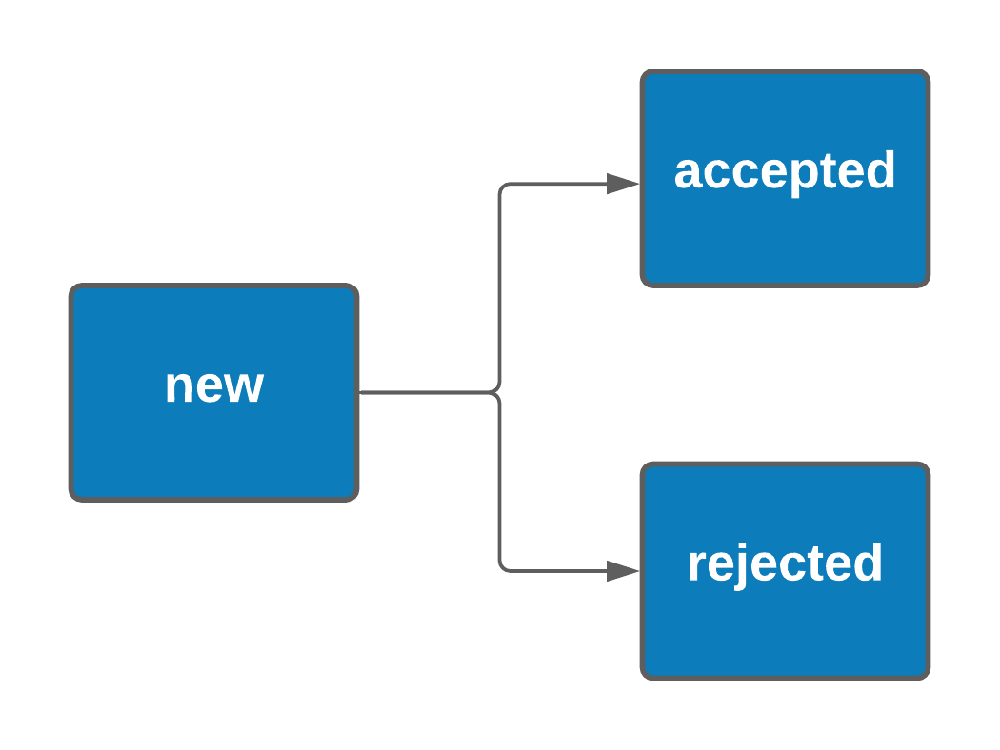
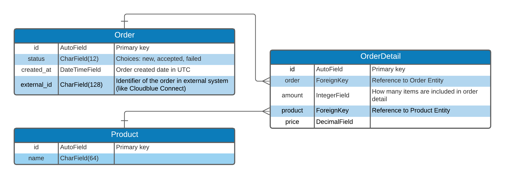

# Order Flow
Let's first understand what term *Order* means in our eCommerce system and what business process it has.
1. ***Order*** is an entity that provides information about what user want to buy
2. One ***Order*** can contain different products with different quantity and different prices. The entity, that includes this information in ***Order*** is called ***Order Detail***
3. ***Order*** can be bound with entity, that represents same ***Order*** in some external system. For example it can be **Cloudblue Connect**. It is needed for simplification of tracking ***Order*** in different systems
4. ***Order*** is created in status *'new'*
5. User, who process ***Orders***, can move them to status *'accepted'* or *'rejected'*
6. User cannot delete *'accepted'* ***Orders***

***Order*** flow can be described with simple state diagram below:


## General Techical Requirements
1. Programming language: python
2. Frameworks: Django + Django REST Framework
3. Web application should contain unit tests
4. Testing framework: unittest or pytest
3. Feel free to use any additional Django library
4. Use any SQL database you want

## General Solution Requirements
1. Web Application should be implemented as Open System - means that any additional unknown input field should be ignored and request should not fail
2. API should accept and return data only in JSON format
2. Collections List API should support paging
3. For Collections List API user should be able to define 'limit' and 'offset' query parameters for paging
4. Collections List API as a response body should return only list of entities
5. Collections List API should return paging information in header 'Content-Range' in format 'items <from-number>-<to-number>/<total>'
3. There should be proper handling of exceptions in API
4. There is no need for Authentication and Authorization processes
5. PUT should be implemented as a partial update
6. API should be covered with unit tests


### DB Structure
Database structure can be described with following schema:




### API description
Find detailed API description here

| HTTP Method | URL                 | Filters             | Ordering               | Response Code |
| ----------- | ----------------    | ------------------- | ---------------------- | ------------- |
| GET         | /api/v1/orders      | external_id, status | id, status, created_at | 200 |
| GET         | /api/v1/orders/<id> | - | - | 200 |
| POST        | /api/v1/orders      | - | - | 201 |
| PUT         | /api/v1/orders/<id> | - | - | 200 |
| DELETE      | /api/v1/orders/<id> | - | - | 204 |

> Note: User cannot delete *'accepted'* ***Orders***
Also to switch ***Order*** between statuses API should support custom nested actions

| HTTP Method | URL                 | Filters             | Ordering               | Response Code |
| ----------- | ----------------    | ------------------- | ---------------------- | ------------- |
| POST         | /api/v1/orders/id/accept      | - | - | 200 |
| POST         | /api/v1/orders/id/fail      | - | - | 200 |

Find detailed description of request/response bodies below. If there is no information for some API's treat it as request/response bodies are empty in that case

### GET /api/v1/orders Response Body
```json
[{
    "id": 1,
    "status": "new",
    "created_at": "2021-01-01T00:00:00",
    "external_id": "PR-123-321-123",
    "details": [{
        "id": 1,
        "product": {"id": 4, "name": "Dropbox"},
        "amount": 10,
        "price": "12.00"
    }, ...]
}, ...]
```

> Note: GET /api/v1/orders/<id> contains same fields in response, but returns particular ***Order*** instead list of ***Orders***
### POST /api/v1/orders Request Body
```json
[{
    "external_id": "PR-123-321-123",
    "details": [{
        "product": {"id": 4},
        "amount": 10,
        "price": "12.00"
    }, ...]
}, ...]
```

### POST /api/v1/orders Response Body
Response body should contain just created ***Order*** entity with order details information
```json
[{
    "id": 1,
    "status": "new",
    "created_at": "2021-01-01T00:00:00",
    "external_id": "PR-123-321-123",
    "details": [{
        "id": 1,
        "product": {"id": 4, "name": "Dropbox"},
        "amount": 10,
        "price": "12.00"
    }, ...]
}, ...]
```

### PUT /api/v1/orders/<id> Request Body
> Note: for ***Order*** User is able only to update *'external_id'* field. Other fields should be ignored even if they were passed in request body
> Note: Only ***Orders*** in status '*new*' are able to be updated
```json
[{
    "id": 1,
    "status": "new",
    "created_at": "2021-01-01T00:00:00",
    "external_id": "PR-123-321-123-new",
    "details": [{
        "id": 1,
        "product": {"id": 4, "name": "Dropbox"},
        "amount": 10,
        "price": "12.00"
    }, ...]
}, ...]
```

### PUT /api/v1/orders/<id> Response Body
Response body is same as response bodies for GET, POST operations

```json
{
    "id": 1,
    "status": "new",
    "created_at": "2021-01-01T00:00:00",
    "external_id": "PR-123-321-123",
    "details": [{
        "id": 1,
        "product": {"id": 4, "name": "Dropbox"},
        "amount": 10,
        "price": "12.00"
    }, ...]
}
```

# Installation

#### Install the dependencies and start the server.
```
git clone https://github.com/TheHamCore/Order_flow_api.git
cd Order_flow_api
python -m venv venv
venv/Scripts/activate
pip install -r requirements.txt
```

#### If you want to launch with a local database you will have to write next command
```python manage.py migrate```

#### Run the server
```python3 manage.py runserver```

***Check your  http://127.0.0.1:8000/***

### Docker
```
for building your app
docker-compose build

for running your app
docker-compose build
```
***Check your  http://0.0.0.0:8000/***

